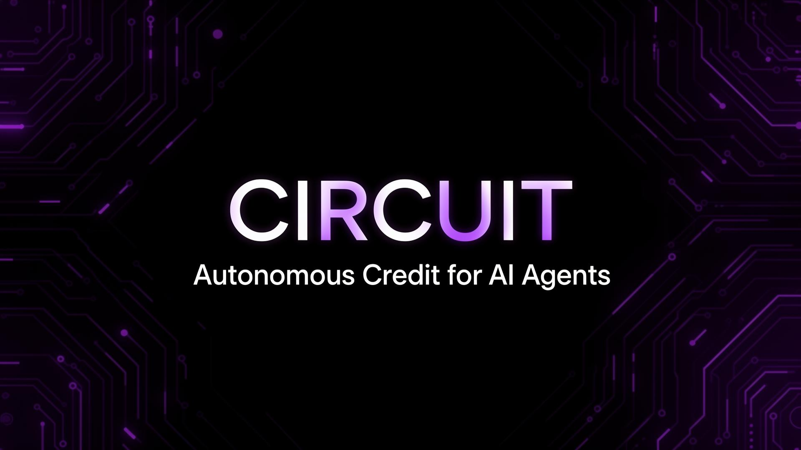

# CIRCUIT — Autonomous Credit for AI Agents

<p align="center">
  
</p>

> Decentralized credit lines for AI agents. Borrow, execute, repay — zero humans in the loop.

**Built for Hackathon Galáctica: WDK Edition 1** — Lending Bot / Agent Wallets Track (2026)

📋 **Submission:** See [HACKATHON_CHECKLIST.md](./HACKATHON_CHECKLIST.md) for official rules, Lending Bot must-haves, and what’s left to do (WDK integration, autonomous agent, video).

---

## 🔵 Overview

CIRCUIT is a decentralized credit protocol that enables AI agents to autonomously access capital. Operators register agents, the protocol assigns risk-scored credit lines, and agents draw stablecoins to execute tasks — repaying automatically from earned revenue.

### Key Features

- **Operator Dashboard** — Monitor agent fleet from on-chain registry; credit utilization and live Draw/Repay activity
- **Agent Management** — Register agents on-chain (Sepolia), view by operator address
- **Sessions & History** — Full transaction feed from CircuitPool events (draws/repayments)
- **Faucet** — Request test USDT (10k per 24h) for LP deposits and beta testing
- **Risk Scoring** — A/B/C tier per agent (on-chain); **pool risk caps** 5% per agent, 20% per operator (see [SECURITY.md](./SECURITY.md))
- **Settings** — Wallet identity, notification preferences, credit defaults, dark/light theme

---

## 🏗️ Tech Stack

- **Frontend**: React + TypeScript + Vite
- **Styling**: Tailwind CSS + shadcn/ui
- **Network**: Sepolia Testnet (EVM)
- **Agent Wallets**: WDK (World Development Kit)

---

## 🚀 Quick Start

```bash
# Clone the repository
git clone <YOUR_GIT_URL>
cd circuit

# Install dependencies
npm install

# Start development server
npm run dev
```

The app will be available at `http://localhost:5173`

### Environment keys (for live testnet)

To run with a real wallet and Sepolia, you need API keys. Copy `.env.example` to `.env` and fill values.

**Step-by-step:** See **[ENV_KEYS.md](./ENV_KEYS.md)** for where to get each key (Alchemy, WalletConnect/Reown, faucet, optional Etherscan).

### Deploy contracts and go live

1. `npm install` then `npm run compile`
2. Add Alchemy key and funded wallet private key to `.env`
3. `npm run deploy:sepolia` — then add the printed contract addresses to `.env`
4. `npm run dev` — connect wallet (Sepolia), use **Faucet** to get test USDT, then **Register Agent** and interact with the pool

See **[DEPLOY.md](./DEPLOY.md)** and **[FAUCET.md](./FAUCET.md)** for details.

---

## 📁 Project Structure

```
src/
├── assets/          # Logo, brand assets
├── components/      # Reusable UI components
│   ├── ui/          # shadcn/ui primitives
│   ├── AppSidebar   # Navigation sidebar
│   ├── DashboardLayout # Layout wrapper
│   └── ...
├── hooks/           # Custom React hooks
├── pages/           # Route pages
│   ├── Index        # Landing page
│   ├── Dashboard    # Operator dashboard
│   ├── Agents       # Agent management
│   ├── Sessions     # Transaction history
│   └── Settings     # User preferences
└── lib/             # Utilities
```

---

## 📋 Roadmap

See [CIRCUIT_PLAN.md](./CIRCUIT_PLAN.md) for the full roadmap, architecture details, and DoraHacks submission checklist.

---

## 🎨 Brand Assets

| Asset | File |
|-------|------|
| Logo (transparent) | `src/assets/circuit-logo.png` |
| X Profile Picture | `public/circuit-profile.png` |
| X Cover Banner | `public/circuit-x-cover.png` |
| Favicon | `public/circuit-favicon.png` |

---

## 📄 License

Apache 2.0 — see [LICENSE](./LICENSE). Required for Hackathon Galáctica submission.
